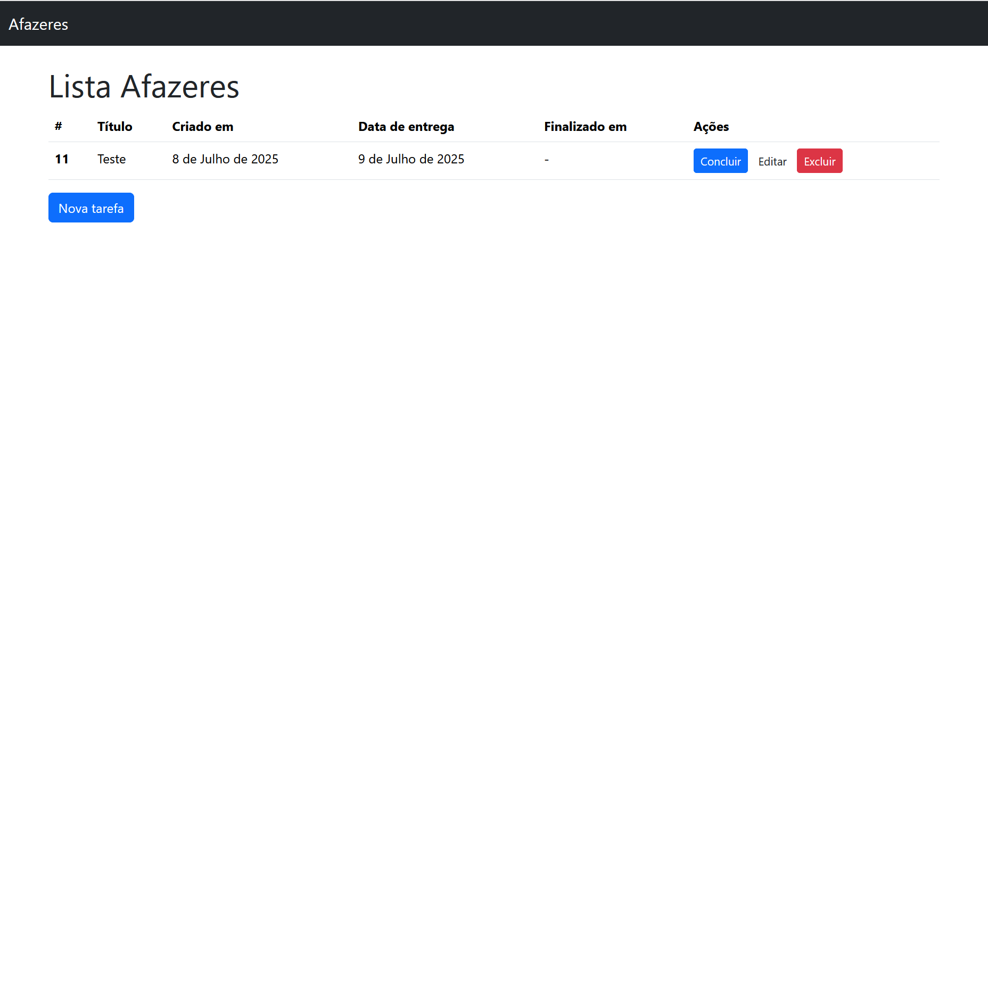

<h1>📝 Lista de Afazeres (Django + Bootstrap)</h1>

Projeto simples para estudo de CRUD. Lista de afazeres desenvolvido com Django no backend e Bootstrap no frontend, permitindo criar, visualizar, atualizar e excluir tarefas de forma rápida e organizada.

🚀 Funcionalidades

✅ Adicionar novas tarefas

✅ Marcar tarefas como concluídas ou pendentes

✅ Editar o texto da tarefa

✅ Excluir tarefas

✅ Interface responsiva utilizando Bootstrap

<h1>🛠️ Tecnologias</h1>

Django – backend, gerenciamento de rotas e banco de dados

Bootstrap – estilização e responsividade

SQLite

<h1>📸 Screenshot</h1>

<h1>⚙️ Como rodar o projeto localmente</h1>

1️⃣ Clone o repositório:

git clone https://github.com/seu-usuario/seu-repositorio.git

2️⃣ Crie e ative o ambiente virtual:

python -m venv venv
source venv/bin/activate  # Linux/Mac
venv\Scripts\activate   # Windows

3️⃣ Instale as dependências:

pip install -r requirements.txt

4️⃣ Realize as migrações:

python manage.py migrate

5️⃣ Rode o servidor:

python manage.py runserver

6️⃣ Acesse no navegador:

http://127.0.0.1:8000/
